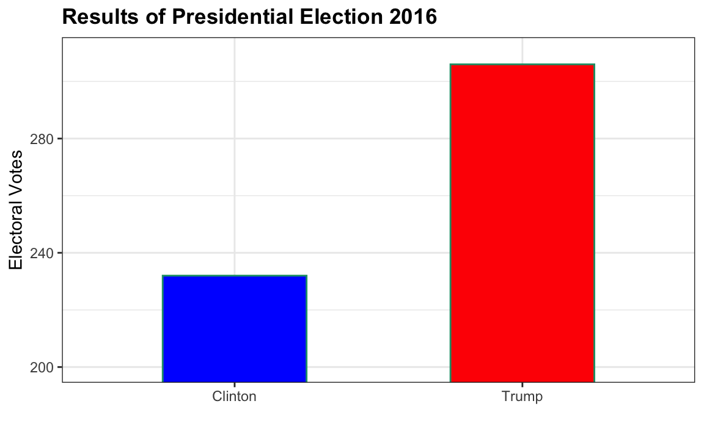
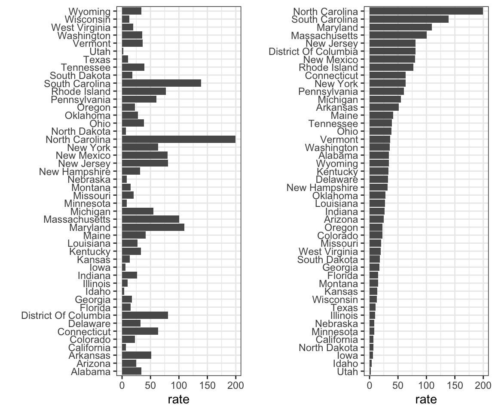
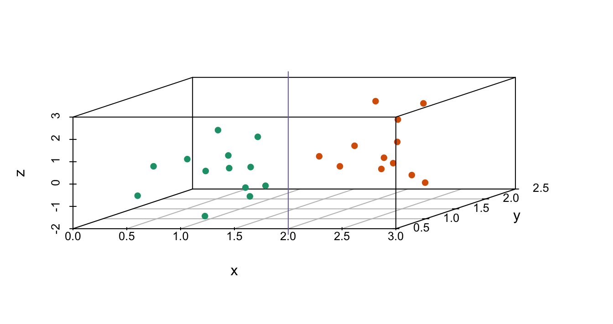
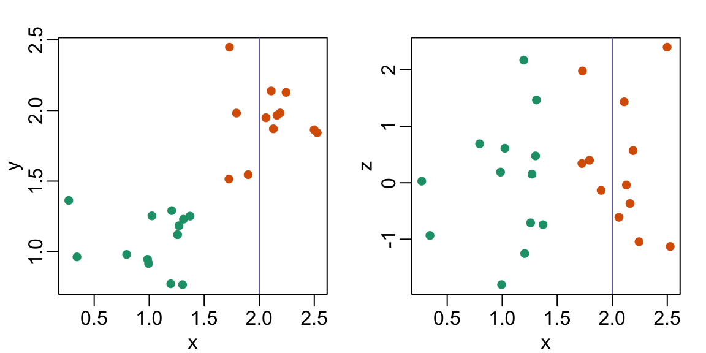

*From: Introduction to Data Science: Data analysis and prediction algorithms with R by Rafael A.Irizarry*

For these exercises, we will be using the vaccines data in the dslabs package:
```{r}
library(dslabs)
library(dplyr)
library(ggplot2)
```

1. Pie charts are appropriate:

a. When we want to display percentages.
b. When ggplot2 is not available.
c. When I am in a bakery.
d. **Never. Barplots and tables are always better.**

2. What is the problem with the plot below:
<center>

</center>
a. The values are wrong. The final vote was 306 to 232.
b. **The axis does not start at 0. Judging by the length, it appears Trump received 3 times as many votes when, in fact, it was about 30% more.**
c. The colors should be the same.
d. Percentages should be shown as a pie chart.

3. Take a look at the following two plots. They show the same information: 1928 rates of measles across the 50 states.
<center>

</center>
Which plot is easier to read if you are interested in determining which are the best and worst states in terms of rates, and why?

a. They provide the same information, so they are both equally as good.
b. The plot on the right is better because it orders the states alphabetically.
c. **The plot on the right is better because alphabetical order has nothing to do with the disease and by ordering according to actual rate, we quickly see the states with most and least rates.**
d. Both plots should be a pie chart.

4. To make the plot on the left, we have to reorder the levels of the states’ variables.
```{r}
dat <- us_contagious_diseases |>  
  filter(year == 1967 & disease=="Measles" & !is.na(population)) |>
  mutate(rate = count / population * 10000 * 52 / weeks_reporting)
```
Note what happens when we make a barplot:
```{r}
dat |> ggplot(aes(state, rate)) +
  geom_col() +
  coord_flip() 
```
Define these objects:
```{r}
state <- dat$state
rate <- dat$count/dat$population*10000*52/dat$weeks_reporting
```

Redefine the state object so that the levels are re-ordered. Print the new object state and its levels so you can see that the vector is not re-ordered by the levels.
```{r}
state <- reorder(state, rate)
print(state)
levels(state)
```

5. Now with one line of code, define the dat table as done above, but change the use mutate to create a rate variable and re-order the state variable so that the levels are re-ordered by this variable. Then make a barplot using the code above, but for this new dat.
```{r}
dat <- us_contagious_diseases |>  
  filter(year == 1967 & disease=="Measles" & !is.na(population)) |>
  mutate(rate = count / population * 10000 * 52 / weeks_reporting) |>   mutate(state = reorder(state, rate))
```
```{r}
dat |> ggplot(aes(state, rate)) +
  geom_col() +
  coord_flip() 
```


6. Say we are interested in comparing gun homicide rates across regions of the US. We see this plot:
```{r}
library(dslabs)
murders |> mutate(rate = total/population*100000) |>
group_by(region) |>
summarize(avg = mean(rate)) |>
mutate(region = factor(region)) |>
ggplot(aes(region, avg)) +
geom_col() + 
ylab("Murder Rate Average")
```
and decide to move to a state in the western region. What is the main problem with this interpretation?

a. The categories are ordered alphabetically.
b. The graph does not show standarad errors.
c. **It does not show all the data. We do not see the variability within a region and it’s possible that the safest states are not in the West.**
d. The Northeast has the lowest average.

7. Make a boxplot of the murder rates defined as
```{r}
murders |> mutate(rate = total/population*100000) |> group_by(region) |> ggplot(aes(reorder(region, rate, median), rate)) + geom_boxplot()
```
by region, showing all the points and ordering the regions by their median rate.

8. The plots below show three continuous variables.
<center>

</center>
The linear x=2 appears to separate the points. But it is actually not the case, which we can see by plotting the data in a couple of two-dimensional points.
<center>

</center>

Why is this happening?
a. **Humans are not good at reading pseudo-3D plots.**
b. There must be an error in the code.
c. The colors confuse us.
d. Scatterplots should not be used to compare two variables when we have access to 3.
